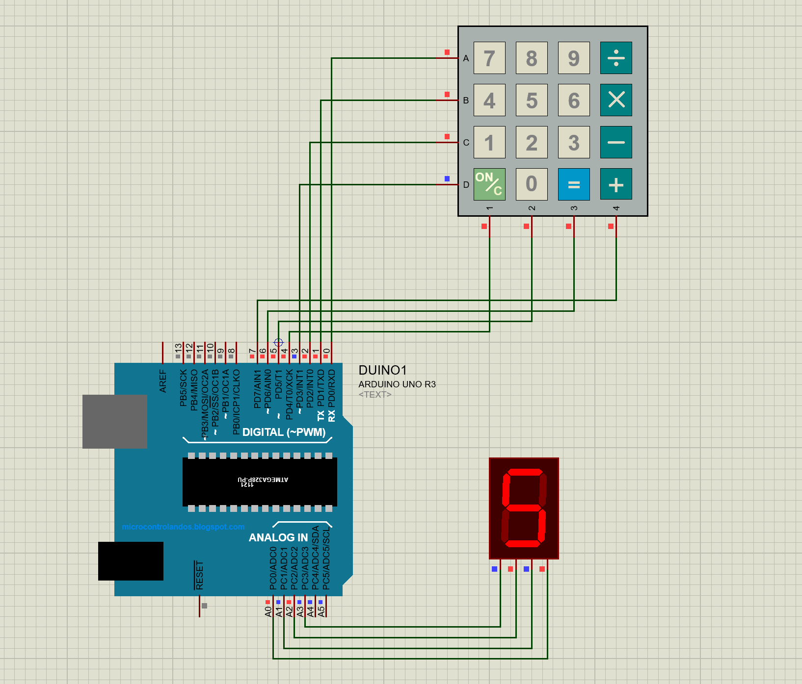

4x4 Keypad_interface
================

Introduction
------------
A 4x4 Keypad interfacing and displaying the output (Numbers) to BCD 7-segment using the AVR toolchain without the Arduino IDE.

Hardware
--------
* USB Type A to Type B cable
* Arduino Uno with the Atmel ATmega328p microcontroller.
* BCD 7-segment
* 16x2 LCD

Circuit
--------

Installation
------------
You will need to have the AVR toolchain installed on your system. This includes:
* avr-gcc
* avr-libc
* avrdude

Support
------
Please feel free to contact me if you have any questions/concerns. My email address is hossam_elbahrawy@hotmail.com